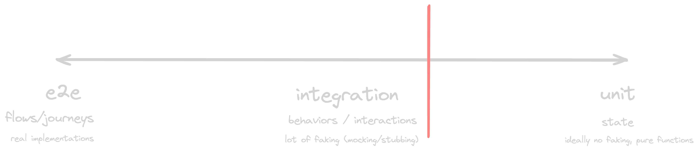

theme: poster

# [fit] How to write

# [fit] unbreakable 

[.footer: by Samuel Farkas]

---

# [fit] Opinion

# [fit] Alert

---


---


---

# [fit] Good code is the code you can write test for without crying

- Simple and predictable
- Easy to maintain and understand
- Well-defined interfaces
- Loose coupling and separation of concerns
- Self-documenting

---

# Great, but how?

- Leverage pure functions
- Make side-effects noticeable and easily fakeable
- Limit cyclomatic complexity
- Leverage single responsibility principle, separation of concerns and dependency injection (if it makes sense)

---

[.column]

```typescript
export function TodoList() {
  const [todos, setTodos] = useState<Todo[]>([]);
  const [todoInput, setTodoInput] = useState("");
  const [selectedTodos, setSelectedTodos] = useState<Todo[]>([]);

  const [isLoading, setLoading] = useState(true);
  const [hasError, setError] = useState<Error>();

  useEffect(() => {
    fetch(API_URL).then((response) => {
      response
        .json()
        .then((data) => {
          setTodos(data);
          setLoading(false);
        })
        .catch((e) => {
          setError(e);
          setLoading(false);
        });
    });
  }, []);

  if (isLoading) {
    return <div>Loading...</div>;
  }

  if (hasError) {
    return <div>Error: {hasError.message}</div>;
  }


  const update = ({
    action,
    title,
    id,
  }: {
    action: "DELETE" | "ADD" | "COMPLETED";
    title?: string;
    id?: number;
  }) => {
    if (action === "DELETE") {
        // ...fetch..
        .then(() => {
          setTodos(response.data)
        })
    } else if (action === "ADD" && title) {
        fetch(API_URL, {
            body: JSON.stringify({ title: title.replace(/<[^>]*>?/gm, "")
            .replace(/]*src="([^"]*)"[^>]*>/g, "[Image]") }),
        })
        .then((response) => {
            setTodos(response.data)
        })
    } else if (action === "COMPLETED" && id) {
        // ...fetch..
        .then((response) => {
            setTodos(response.data)
        })
    }
  };
```

[.column]

```typescript

  const select = (todo: Todo | Todo[]) => {
    setSelectedTodos((prevSelectedTodos) => {
      if (prevSelectedTodos.includes(id)) {
        return prevSelectedTodos.filter((selectedTodo) => selectedTodo !== id);
      }
      return [...prevSelectedTodos, id];
    });
  };


  return (
    <>
      <input
        type="text"
        value={todoInput}
        onChange={(e) => setTodoInput(e.target.value)}
      />
      <button
        onClick={() =>
          update({
            action: "ADD",
            title: todoInput,
          })
        }
      >
        Add
      </button>
      <ul>
        {todos.map((todo) => (
          <li key={todo.id}>
            <input
              type="checkbox"
              checked={todo.completed}
              onChange={() =>
                update({
                  action: "COMPLETED",
                  id: todo.id,
                })
              }
            />
            {todo.title}
            <button
              onClick={() =>
                update({
                  action: "DELETE",
                })
              }
            >
              Delete
            </button>
          </li>
        ))}
      </ul>
    </>
  );
}
```

---

[.build-lists: true]
[.code-highlight: 1-15]
[.column]

```typescript

useEffect(() => {
  fetch(API_URL).then((response) => {
    response
      .json()
      .then((data) => {
        setTodos(data);
        setLoading(false);
      })
      .catch((e) => {
        setError(e);
        setLoading(false);
      });
  });
}, []);

const update = ({
    action,
    title,
    id,
  }: {
    action: "DELETE" | "ADD" | "COMPLETED";
    title?: string;
    id?: number;
  }) => {
    if (action === "DELETE") {
         // ...fetch..
        .then(() => {
          setTodos(response.data)
        })
    } else if (action === "ADD" && title) {
        // ...fetch..
          setTodos(response.data)
        })
    } else if (action === "COMPLETED" && id) {
        // ...fetch..
        .then((response) => {
            setTodos(response.data)
        })
    }
 };

```

[.column]

- Directly embedded side-effect into component logic
- Almost impossible to fake
- Harder to maintain

---

[.code-highlight: 15-45]
[.column]

```typescript

useEffect(() => {
  fetch(API_URL).then((response) => {
    response
      .json()
      .then((data) => {
        setTodos(data);
        setLoading(false);
      })
      .catch((e) => {
        setError(e);
        setLoading(false);
      });
  });
}, []);

const update = ({
    action,
    title,
    id,
}: {
    action: "DELETE" | "ADD" | "COMPLETED";
    title?: string;
    id?: number;
}) => {
    if (action === "DELETE") {
         // ...fetch..
        .then(() => {
          setTodos(response.data)
        })
    } else if (action === "ADD" && title) {
        fetch(API_URL, {
            body: JSON.stringify({ title: title.replace(/<[^>]*>?/gm, "")
            .replace(/]*src="([^"]*)"[^>]*>/g, "[Image]") }),
        })
        .then((response) => {
            setTodos(response.data)
        })
    } else if (action === "COMPLETED" && id) {
        // ...fetch..
        .then((response) => {
            setTodos(response.data)
        })
    }
};

```

[.column]
[.build-lists: true]

- Hard to read
- Higher cyclomatic complexity
- Violating single responsibility principle and separation of concerns (UI updates, Business Logic, Network calls)
- Directly embedded side-effects in function's logic

---

[.build-lists: true]
[.code-highlight: 1-18]
[.column]

```typescript

  const select = (id: number) => {
    setSelectedTodos((prevSelectedTodos) => {
      if (prevSelectedTodos.includes(id)) {
        return prevSelectedTodos.filter((selectedTodo) => selectedTodo !== id);
      }
      return [...prevSelectedTodos, id];
    });
  };


  return (
    <>
      <input
        type="text"
        value={todoInput}
        onChange={(e) => setTodoInput(e.target.value)}
      />
      <button
        onClick={() =>
          update({
            action: "ADD",
            title: todoInput,
          })
        }
      >
        Add
      </button>
      <ul>
        {todos.map((todo) => (
          <li key={todo.id}>
            <input
              type="checkbox"
              checked={todo.completed}
              onChange={() =>
                update({
                  action: "COMPLETED",
                  id: todo.id,
                })
              }
            />
            {todo.title}
            <button
              onClick={() =>
                update({
                  action: "DELETE",
                })
              }
            >
              Delete
            </button>
          </li>
        ))}
      </ul>
    </>
  );
}


```

[.column]

- Contains side-effect that makes it untestable
- Handles untestable internal logic

---

[.build-lists: true]
[.code-highlight: 20-70]
[.column]

```typescript

  const select = (todo: Todo | Todo[]) => {
     setSelectedTodos((prevSelectedTodos) => {
      if (prevSelectedTodos.includes(id)) {
        return prevSelectedTodos.filter((selectedTodo) => selectedTodo !== id);
      }
      return [...prevSelectedTodos, id];
    });
  }


  return (
    <>
      <input
        type="text"
        value={todoInput}
        onChange={(e) => setTodoInput(e.target.value)}
      />
      <button
        onClick={() =>
          update({
            action: "ADD",
            title: todoInput,
          })
        }
      >
        Add
      </button>
      <ul>
        {todos.map((todo) => (
          <li key={todo.id}>
            <input
              type="checkbox"
              checked={todo.completed}
              onChange={() =>
                update({
                  action: "COMPLETED",
                  id: todo.id,
                })
              }
            />
            {todo.title}
            <button
              onClick={() =>
                update({
                  action: "DELETE",
                })
              }
            >
              Delete
            </button>
          </li>
        ))}
      </ul>
    </>
  );
}


```

[.column]

- Hard to read
- Violates single responsibility principle

---

# So, can we fix it?


---

[.column]

```typescript
const [todos, setTodos] = useState<Todo[]>([]);
const [todoInput, setTodoInput] = useState("");
const [selectedTodos, setSelectedTodos] = useState<Todo[]>([]);

const [isLoading, setLoading] = useState(true);
const [hasError, setError] = useState<Error>();

useEffect(() => {
  fetch(API_URL).then((response) => {
    response
      .json()
      .then((data) => {
        setTodos(data);
        setLoading(false);
      })
      .catch((e) => {
        setError(e);
        setLoading(false);
      });
  });
}, []);
```

➡️

[.column]
[.code-highlight: false]

```typescript
const {
  data,
  isLoading: areTodosLoading,
  isError: hasTodosError,
} = useTodosQuery();

const [addTodo, { isLoading: isAddingTodo }] = useAddTodoMutation();
const [deleteTodo, { isLoading: isDeletingTodo }] = useDeleteTodoMutation();
const [updateTodo, { isLoading: isUpdatingTodo }] = useUpdateTodoMutation();
```

---

[.column]
[.code-highlight: false]

```typescript
const [todos, setTodos] = useState<Todo[]>([]);
const [todoInput, setTodoInput] = useState("");
const [selectedTodos, setSelectedTodos] = useState<Todo[]>([]);

const [isLoading, setLoading] = useState(true);
const [hasError, setError] = useState<Error>();

useEffect(() => {
  fetch(API_URL).then((response) => {
    response
      .json()
      .then((data) => {
        setTodos(data);
        setLoading(false);
      })
      .catch((e) => {
        setError(e);
        setLoading(false);
      });
  });
}, []);
```

➡️

[.column]
[.build-lists: true]
[.text: text-scale(0.7)]

```typescript
const {
  data,
  isLoading: areTodosLoading,
  isError: hasTodosError,
} = useTodosQuery();

const [addTodo, { isLoading: isAddTodoLoading }] = useAddTodoMutation();
const [deleteTodo, { isLoading: isDeleteTodoLoading }] =
  useDeleteTodoMutation();
const [updateTodo, { isLoading: isUpdateTodoLoading }] =
  useUpdateTodoMutation();
```

- Moved data management concern into separate hook _(RTKQ, react-query or whatever twitter likes today)_
- Easily fakeable (mockable and stubable)
- Easy to understand, read and declarative (idc about inner implementation)

---

[.column]

```typescript
const update = ({
    action,
    title,
    id,
}: {
    action: "DELETE" | "ADD" | "COMPLETED";
    title?: string;
    id?: number;
}) => {
    if (action === "DELETE") {
         // ...fetch..
        .then(() => {
          setTodos(response.data)
        })
    } else if (action === "ADD" && title) {
        fetch(API_URL, {
            body: JSON.stringify({ title: title.replace(/<[^>]*>?/gm, "")
            .replace(/]*src="([^"]*)"[^>]*>/g, "[Image]") }),
        })
        .then((response) => {
            setTodos(response.data)
        })
    } else if (action === "COMPLETED" && id) {
        // ...fetch..
        .then((response) => {
            setTodos(response.data)
        })
    }
};

```

➡️

[.column]
[.code-highlight: false]

```typescript
const handleAddTodo = (text: string) => {
  const todo = parseMedia(sanitizeText(text));
  return addTodo(todo).catch(handleApiError);
};

const handleDeleteTodo = (id: number) => deleteTodo(id).catch(handleApiError);
const handleCompletedTodo = (id: number) =>
  updateTodo({ id, completed: true }).catch(handleApiError);
```

---

[.column]
[.code-highlight: false]

```typescript
const update = ({
    action,
    title,
    id,
}: {
    action: "DELETE" | "ADD" | "COMPLETED";
    title?: string;
    id?: number;
}) => {
    if (action === "DELETE") {
         // ...fetch..
        .then(() => {
          setTodos(response.data)
        })
    } else if (action === "ADD" && title) {
        fetch(API_URL, {
            body: JSON.stringify({ title: title.replace(/<[^>]*>?/gm, "")
            .replace(/]*src="([^"]*)"[^>]*>/g, "[Image]") }),
        })
        .then((response) => {
            setTodos(response.data)
        })
    } else if (action === "COMPLETED" && id) {
        // ...fetch..
        .then((response) => {
            setTodos(response.data)
        })
    }
};

```

➡️

[.column]
[.build-lists: true]
[.text: text-scale(0.8)]

```typescript
const handleAddTodo = (text: string) => {
  const todo = parseMedia(sanitizeText(text));
  return addTodo(todo).catch(handleApiError);
};

const handleDeleteTodo = (id: number) => deleteTodo(id).catch(handleApiError);
const handleCompletedTodo = (id: number) =>
  updateTodo({ id, completed: true }).catch(handleApiError);
```

- Easily noticable isolated side-effects
- Self-documenting and readable
- Simple and predictable

---

[.column]
[.code-highlight: 3-5]

```typescript
fetch(API_URL, {
  body: JSON.stringify({
    title: title
      .replace(/<[^>]*>?/gm, "")
      .replace(/]*src="([^"]*)"[^>]*>/g, "[Image]"),
  }),
});
```

⬇️

[.code-highlight: 2]

```typescript
const handleAddTodo = (text: string) => {
  const todo = parseMedia(sanitizeText(text));
  return addTodo(todo).catch(handleApiError);
};
```

[.column]
[.text: text-scale(0.7)]

- Extracted logic to pure functions
- Easily testable and declarative
- Simple and easy to read

---

[.column]

```typescript
  return (
    <>
      <input
        type="text"
        value={todoInput}
        onChange={(e) => setTodoInput(e.target.value)}
      />
      <button
        onClick={() =>
          update({
            action: "ADD",
            title: todoInput,
          })
        }
      >
        Add
      </button>
      <ul>
        {todos.map((todo) => (
          <li key={todo.id}>
            <input
              type="checkbox"
              checked={todo.completed}
              onChange={() =>
                update({
                  action: "COMPLETED",
                  id: todo.id,
                })
              }
            />
            {todo.title}
            <button
              onClick={() =>
                update({
                  action: "DELETE",
                })
              }
            >
              Delete
            </button>
          </li>
        ))}
      </ul>
    </>
  );
}

```

[.column]
[.code-highlight: false]

```typescript
  return (
    <>
      <AddTodoForm onAddTodo={handleAddTodo} />
      <List
        data={data}
        onCompleted={handleCompleteTodo}
        onDeleted={handleDeleteTodo}
        onSelect={handleSelectTodo}
      />
    </>
  );
```

---

[.column]
[.code-highlight: false]

```typescript
  return (
    <>
      <input
        type="text"
        value={todoInput}
        onChange={(e) => setTodoInput(e.target.value)}
      />
      <button
        onClick={() =>
          update({
            action: "ADD",
            title: todoInput,
          })
        }
      >
        Add
      </button>
      <ul>
        {todos.map((todo) => (
          <li key={todo.id}>
            <input
              type="checkbox"
              checked={todo.completed}
              onChange={() =>
                update({
                  action: "COMPLETED",
                  id: todo.id,
                })
              }
            />
            {todo.title}
            <button
              onClick={() =>
                update({
                  action: "DELETE",
                })
              }
            >
              Delete
            </button>
          </li>
        ))}
      </ul>
    </>
  );
}

```

[.column]
[.build-lists: true]
[.text: text-scale(0.8)]

```typescript
  return (
    <>
      <AddTodoForm onAddTodo={handleAddTodo} />
      <List
        data={data}
        onCompleted={handleCompleteTodo}
        onDeleted={handleDeleteTodo}
        onSelect={handleSelectTodo}
      />
    </>
  );
```

- Leverage single responsibility principle
- Presentational components might be considered pure functions
- Leverages dependency injection = fakeable, spyable
- Simple and easy to read

---

```typescript
export function TodoList() {
  const [selectedTodos, setSelectedTodos] = useState([]);

  const {
    data,
    isLoading: areTodosLoading,
    isError: hasTodosError,
  } = useTodosQuery();

  const [addTodo, { isLoading: isAddTodoLoading }] = useAddTodoMutation();
  const [deleteTodo, { isLoading: isDeleteTodoLoading }] =
    useDeleteTodoMutation();
  const [updateTodo, { isLoading: isUpdateTodoLoading }] =
    useUpdateTodoMutation();

  const handleAddTodo = (text: string) => {
    const todo = parseMedia(sanitizeText(text));
    return addTodo(todo).catch(handleApiError);
  };

  const handleDeleteTodo = (id: number) => deleteTodo(id).catch(handleApiError);
  const handleCompleteTodo = (id: number) =>
    updateTodo({ id, completed: true }).catch(handleApiError);

  const handleSelectTodo = (ids: number[]) => {
    // ...handle select
  };

  return (
    <>
      <AddTodoForm onAddTodo={handleAddTodo} />
      <List
        data={data}
        onCompleted={handleCompleteTodo}
        onDeleted={handleDeleteTodo}
        onSelect={handleSelectTodo}
      />
    </>
  );
}

```

---

[.column]

[.code-highlight: 17, 30-37]

```typescript
export function TodoList() {
  const [selectedTodos, setSelectedTodos] = useState([]);

  const {
    data,
    isLoading: areTodosLoading,
    isError: hasTodosError,
  } = useTodosQuery();

  const [addTodo, { isLoading: isAddTodoLoading }] = useAddTodoMutation();
  const [deleteTodo, { isLoading: isDeleteTodoLoading }] =
    useDeleteTodoMutation();
  const [updateTodo, { isLoading: isUpdateTodoLoading }] =
    useUpdateTodoMutation();

  const handleAddTodo = (text: string) => {
    const todo = parseMedia(sanitizeText(text));
    return addTodo(todo).catch(handleApiError);
  };

  const handleDeleteTodo = (id: number) => deleteTodo(id).catch(handleApiError);
  const handleCompleteTodo = (id: number) =>
    updateTodo({ id, completed: true }).catch(handleApiError);

  const handleSelectTodo = (ids: number[]) => {
    // ...handle select
  };

  return (
    <>
      <AddTodoForm onAddTodo={handleAddTodo} />
      <List
        data={data}
        onCompleted={handleCompleteTodo}
        onDeleted={handleDeleteTodo}
        onSelect={handleSelectTodo}
      />
    </>
  );
}

```

[.column]
[.text: text-scale(0.6)]
[.list: bullet-character(✅)]

- Unit tests for parser and sanitizer
- Component test for AddTodoForm
- Component test for List

^ ask if we need to test glue component
^ so far this is good and i would be more than confident that it works and look how it should

---


---

[.column]

[.code-highlight: all]

```typescript
export function TodoList() {
  const [selectedTodos, setSelectedTodos] = useState([]);

  const {
    data,
    isLoading: areTodosLoading,
    isError: hasTodosError,
  } = useTodosQuery();

  const [addTodo, { isLoading: isAddTodoLoading }] = useAddTodoMutation();
  const [deleteTodo, { isLoading: isDeleteTodoLoading }] =
    useDeleteTodoMutation();
  const [updateTodo, { isLoading: isUpdateTodoLoading }] =
    useUpdateTodoMutation();

  const handleAddTodo = (text: string) => {
    const todo = parseMedia(sanitizeText(text));
    return addTodo(todo).catch(handleApiError);
  };

  const handleDeleteTodo = (id: number) => deleteTodo(id).catch(handleApiError);
  const handleCompleteTodo = (id: number) =>
    updateTodo({ id, completed: true }).catch(handleApiError);

  const handleSelectTodo = (ids: number[]) => {
    // ...handle select
  };

  return (
    <>
      <AddTodoForm onAddTodo={handleAddTodo} />
      <List
        data={data}
        onCompleted={handleCompleteTodo}
        onDeleted={handleDeleteTodo}
        onSelect={handleSelectTodo}
      />
    </>
  );
}

```

[.column]
[.text: text-scale(0.6)]
[.list: bullet-character(✅)]

- Unit tests for parser and sanitizer
- Component test for AddTodoForm
- Component test for List
- Integration test for TodoList

---


---


^ imagine that what kind of tests we can write is kind of range
^ on the left we can only write e2e tests, where our code is basically untestable
^ on the right we can write every type of test, because our code easily testable

---


^ in the first variant of the code we basically could write sort of integration test and e2e
^ integration test could assert DOM changes and mock network requests, but thats all. We couldnt actually test any details.

---



^ by refactoring we just expanded our possibilites for writing tests and cover more code
^ so question is, can we do something to move further to the right?

---

[.column]

```typescript
export function useList() {
  const [selectedTodos, setSelectedTodos] = useState<number[]>([]);

  const {
    data,
    isLoading: areTodosLoading,
    isError: hasTodosError,
  } = useTodosQuery();

  const [addTodo] = useAddTodoMutation();
  const [deleteTodo] = useDeleteTodoMutation();
  const [updateTodo] = useUpdateTodoMutation();

  const addTodo = (text: string) => {
    const todo = parseMedia(sanitizeText(text));
    return addTodo(todo).catch(handleApiError);
  };

  const deleteTodo = (id: number) => deleteTodo(id).catch(handleApiError);

  const completeTodo = (id: number) =>
    updateTodo({ id, completed: true }).catch(handleApiError);

  const toggleSelectedTodo = (id: number) => {
    setSelectedTodos((prevSelectedTodos) => {
      if (prevSelectedTodos.includes(id)) {
        return prevSelectedTodos.filter((selectedTodo) => selectedTodo !== id);
      }
      return [...prevSelectedTodos, id];
    });
  };

  return {
    todos: data,
    selectedTodos,
    isLoading: areTodosLoading,
    hasError: hasTodosError,
    actions: {
      addTodo,
      deleteTodo,
      updateTodo,
      completeTodo,
      toggleSelectedTodo,
    },
  };
}
```

[.column]
[.build-lists: true]

- Internal state becomes testable

---

```typescript
describe("useList hook", () => {
  it("should toggle selectedTodos correctly", () => {
    const { result } = renderHook(() => useList());

    // Initially, selectedTodos should be empty
    expect(result.current.selectedTodos).toEqual([]);

    // Add an item to selectedTodos
    act(() => {
      result.current.actions.toggleSelectedTodo(1);
    });
    expect(result.current.selectedTodos).toEqual([1]);

    act(() => {
      result.current.actions.toggleSelectedTodo(2);
    });
    expect(result.current.selectedTodos).toEqual([1, 2]);

    // Remove the first item from selectedTodos
    act(() => {
      result.current.actions.toggleSelectedTodo(1);
    });
    expect(result.current.selectedTodos).toEqual([2]);

    act(() => {
      result.current.actions.toggleSelectedTodo(2);
    });
    expect(result.current.selectedTodos).toEqual([]);
  });
});
```

---

```typescript
export function TodoList() {
  const { todos, selectedTodos, actions, isLoading, hasError } = useList();

  if (isLoading) return <div>Loading...</div>;
  if (hasError) return <div>Error...</div>;

  return (
    <>
      <AddTodoForm onAddTodo={actions.addTodo} />
      <List
        data={todos}
        selectedTodosIds={selectedTodos}
        onCompleted={actions.completeTodo}
        onDeleted={actions.deleteTodo}
        onSelect={actions.toggleSelectedTodo}
      />
    </>
  );
}
```

---


---

## Was it worth it, tho?


^ mention that the first code was actually testable and we would only be able to test behavior, which would prevent umbrella scenario
^ say how this might not be actually neccessary and talk about balance
^ moving this logic to hook costs - maybe unnecessary separation, test might not be that valuable, we need to create and think about new and good interface
^ diminishing returns, even tho it was fairly cheap to code, its hard to say if we gained value out of it, we actually might worsen the readability
^ i would be totally happy with variant 2 and forced pushed that to prod on friday night confidently

---


---

[.column]

```typescript
export function useVehicleAlbumImageSelection() {
  const [selectedImagesIds, setSelectedImagesIds] = useState<Set<string>>(
    new Set(),
  );

  const getSelectedImages = () => Array.from(selectedImagesIds);

  const isImageSelected = (id: string) => selectedImagesIds.has(id);

  const selectImage = (id: string) => {
    setSelectedImagesIds((prev) => new Set(prev).add(id));
  };

  const selectImagesInBulk = (ids: string[]) => {
    setSelectedImagesIds(new Set(ids));
  };

  const deselectImage = (id: string) => {
    if (selectedImagesIds.has(id)) {
      setSelectedImagesIds((prevSet) => {
        const updatedSet = new Set(prevSet);
        updatedSet.delete(id);
        return updatedSet;
      });
    }
  };

  const clearImageSelection = () => {
    setSelectedImagesIds(new Set());
  };

  const toggleImageSelection = (id: string) => {
    setSelectedImagesIds((prevSet) => {
      const updatedSet = new Set(prevSet);
      if (updatedSet.has(id)) {
        updatedSet.delete(id);
      } else {
        updatedSet.add(id);
      }
      return updatedSet;
    });
  };

  return {
    getSelectedImages,
    selectImage,
    deselectImage,
    isImageSelected,
    selectImagesInBulk,
    toggleImageSelection,
    clearImageSelection,
  };
}
```

[.column]

```typescript
describe("useVehicleAlbumImageSelection", () => {
  //...
  it("should select a single image", () => {
    const { result } = renderHook(() => useVehicleAlbumImageSelection());

    act(() => {
      result.current.selectImagesInBulk(["image1"]);
    });

    expect(result.current.getSelectedImages()).toHaveLength(1);
    expect(result.current.getSelectedImages()).toContain("image1");
  });

  it("should select multiple images in bulk", () => {
    const { result } = renderHook(() => useVehicleAlbumImageSelection());

    act(() => {
      result.current.selectImagesInBulk(["image1", "image2", "image3"]);
    });

    expect(result.current.getSelectedImages()).toHaveLength(3);
    expect(result.current.getSelectedImages()).toEqual(
      expect.arrayContaining(["image1", "image2", "image3"]),
    );
  });

  it("should deselect an image", () => {
    const { result } = renderHook(() => useVehicleAlbumImageSelection());

    act(() => {
      result.current.selectImagesInBulk(["image1"]);
      result.current.toggleImageSelection("image1");
    });

    expect(result.current.getSelectedImages()).toHaveLength(0);
  });

  it("should handle selecting the same image multiple times correctly", () => {
    const { result } = renderHook(() => useVehicleAlbumImageSelection());

    act(() => {
      result.current.selectImagesInBulk(["image1", "image1", "image1"]);
    });

    expect(result.current.getSelectedImages()).toEqual(["image1"]);
  });
  //...
});
```

---

# Well-defined interfaces

- Interface defines contract for interaction (components, functions, endpoints)
- Good interface makes code easier to test
- Good interface makes code more readable
- Good interface makes code less error-prone

^ internal logic and code can be dumpster fire, but if it has good interface its still testable and usable

---

# Bad Interface

[.column]

```typescript
interface ListProps {
  data: any[];
  onChange: (data: any) => void;
  onAction: Function;
}
```

[.column]

- Poorly typed
- Ambigous onChange and onAction function, what is the purpose of it and what im supposed to provide there?

---

# Better interface

[.column]

```typescript
interface ListProps {
  todos: Todo[];
  onAddTodo: (content: string) => void;
  onUpdateTodo: (id: number, updatedContent: string) => void;
  onToggleTodoCompletion: (id: number) => void;
  onDeleteTodo: (id: number) => void;
}
```

[.column]
[.text: text-scale(0.7)]

- Strongly typed
- Uses concise naming
- Has specific function signatures
- Developer knows what to provide to component without checking internal implementation
- Testable
- Self-documenting

---

# Self-documenting code

- Testable code has high chance of being self-documenting
- Tests are part of the documentation
- Leverage concise naming
- If you need to write comment to explain what code does = 🚮
- Write comments to explain decisions

---

# DISCUSSION

